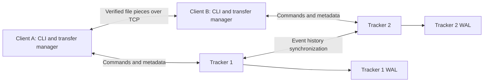

# P2P File-Sharing System — Technical Document

**Scope:** Current C++ implementation, reviewed on 29 September 2026. This document covers user/group management, two-tracker replication, publication, and peer-to-peer downloads. Implementation claims are grounded in `src/` and `include/`; earlier plans are not treated as completed features. Design rationale describes the consequences of the implemented choices unless explicitly attributed to existing project documentation.

## 1. Implementation approach

### 1.1 Architecture and responsibilities

The system separates metadata coordination from file transfer. Exactly two trackers maintain account, group, session, and file metadata. Each client combines an interactive command interface, a peer server, and a background download manager. Trackers introduce authorized clients to candidate sources; file bytes travel directly between peers.



Both clients know both tracker endpoints; the diagram shows representative connections. The binaries use C++17, POSIX sockets/file APIs, and standard C++ threads. Hashing, framing, replication, and transfer scheduling are implemented within the project, without an external database or torrent library.

| Module | Responsibility |
| --- | --- |
| [Client CLI](src/client/cli.cpp) | Parses quoted/escaped commands, checks argument counts, maintains the current token and uncertain request, and dispatches operations. |
| [Transfer manager](src/client/transfer.cpp) | Hashes sources, serves pieces, schedules downloads, verifies data, manages authorization caches, and publishes/withdraws availability. |
| [Tracker server](src/tracker/server.cpp) | Accepts connections, forwards requests, controls foreground execution, and exchanges history with the other tracker. |
| [Tracker state](src/tracker/state.cpp) | Applies permissions and state transitions, assigns event identities, deduplicates requests, and replays merged histories. |
| [Journal](src/tracker/journal.cpp) | Stores durable mutation records and detects incomplete or corrupt WAL records. |
| [Networking](src/common/net.cpp) and [protocol](src/common/protocol.cpp) | Validate endpoints, manage descriptors, encode/decode messages, and perform deadline-based socket I/O. |
| [File inspection](src/common/file.cpp) and [SHA-1](src/common/sha1.cpp) | Stream file contents, compute hashes, and validate metadata. |

### 1.2 State model and persistence

The tracker model uses ordered maps for users, groups, and filenames, sets for membership and pending requests, and a vector recording member acceptance order. This supports deterministic listing and replay. File records are scoped by group and basename; each registered share maps a user to the session that published it.

| State | Lifetime and recovery |
| --- | --- |
| Users, credentials, group ownership/membership, pending requests, file metadata, sessions, share registrations | Reconstructed from tracker WAL events. Logout explicitly clears sessions/shares; new logins cannot replace an active session. |
| Tracker request-result index | Rebuilt by replaying events; used to deduplicate successful mutation requests. |
| Tracker heartbeat observations | In-memory and local to each tracker. They start empty after restart and expire after 15 seconds. |
| Client token, sources, download jobs, verified-piece maps, authorization cache, unresolved request | In-memory. No persistent client restart/resume mechanism exists. |
| Shared and completed files | Remain on the clients' filesystems. Trackers do not retain their contents. |

Logging out removes the user's active share registrations but preserves group membership and ownership. Groups therefore survive even when every client is offline. Explicit departure by the last member deletes a group; departure by its owner transfers ownership to the earliest remaining accepted member.

### Client session lifecycle

A second login for an account with a current token is rejected without invalidating the first client. `State::execute()` performs the check after request-ID deduplication and credential validation, under its state mutex. A retry of the original successful login can therefore recover the original token. New logins must go through tracker 1, including requests received by tracker 2; new session issuance deliberately sacrifices secondary-only availability to prevent duplicate admission during partitions.

The client uses `sigaction()` handlers that only set a `sig_atomic_t` exit flag. A buffered `read()`/`poll()` input loop checks it regularly, including while a partial command is pending. `quit`, `exit`, EOF, SIGINT, SIGTERM, and SIGHUP converge on one cleanup path: stop local sharing/download activity, resolve a pending uncertain login if possible, submit logout, and join workers on destruction. In-flight RPCs can delay cleanup until they return. If an explicit logout response was lost, exit reuses that logout request ID.

Successful logout removes session/share registrations while retaining groups and memberships. Failed cleanup is reported on stderr. SIGKILL, crashes, power loss, or unavailable trackers can leave an account registered; heartbeat expiry filters discovery only and is not a session lease. The current implementation has no automatic stale-session expiry or account-reset command. A stored session token can still be used for explicit logout; restarting trackers does not clear sessions.

Existing WAL files remain replayable: the new exclusivity check applies to new requests in `execute()`, while `apply()` retains the older login transition for historical events. This preserves state derived from past replacement logins instead of invalidating their dependent group/file operations during an upgrade. Run the updated binary on both trackers; mixed versions cannot enforce the new admission rule consistently.

### 1.3 Publication and transfer lifecycle

1. `upload_file` opens a regular file and retains its descriptor. Inspection calculates a whole-file SHA-1 and one hash per 512 KiB piece using a reusable buffer. Size and modification/change timestamps are compared before and after hashing.
2. The client submits only metadata to the tracker. Matching metadata for an existing group filename adds a source; different content under that name produces `CONFLICT`.
3. `download_file` requests metadata and live candidate endpoints, opens the existing destination directory, and creates a unique `.p2p-*.part` file relative to that directory descriptor.
4. Workers fetch and verify pieces, write them using `pwrite()`, and expose only verified pieces through the local peer server. Background maintenance announces availability after the first verified piece, or after completion for an empty file.
5. After all pieces arrive, a worker re-reads them, checks the whole-file digest, calls `fsync()`, and installs the final filename using `linkat()`. This fails if another entry already occupies the destination name. The temporary name is then removed.

Holding descriptors preserves access to the opened objects if paths are renamed; it does not make source contents immutable. Outgoing pieces are rehashed to detect changes inconsistent with publication metadata.

### Automatic terminal download notifications

`TransferManager::take_notifications()` examines job state under the transfer mutex and returns each completed or failed job once, using a per-job `terminal_reported` flag. A successful line includes `COMPLETED`, the quoted group and filename, total bytes, verified/total pieces, `integrity=VERIFIED`, and the whole-file SHA-1 digest. A failed line includes `FAILED`, the same identity/size/progress fields, and the specific reason. Total bytes describe the expected file size, not partial bytes written.

The CLI drains notifications between commands and during the input loop's 100 ms polling cycle, so an idle client reports the result without another user command. All console output remains on the CLI thread; download workers only update protected state. Interactive output moves to a new line and prints a fresh prompt after the result. A blocking foreground RPC delays reporting until control returns to the CLI. Exit cleanup also drains results after cancelling active jobs.

Completion becomes eligible only after final SHA-1 verification, `fsync()`, and successful no-replace final installation. `fail()` ignores already-terminal jobs, preserving the first failure reason against late worker errors and preventing a completed result from being overwritten. Recoverable peer/piece errors do not trigger terminal notifications. Logout, group departure, and client exit keep the existing failed-job representation and report their cancellation reason. `show_downloads` continues to provide history independently of the one-time messages. Retrying a download creates a new job with its own terminal notification.

Validation for automatic notifications: the build and transfer, recovery, availability, integration, and session-lifecycle suites passed. The updated checks observe stdout without issuing `show_downloads`, verify completion/hash/size/piece details for normal and empty files, check single failure reports for final hash mismatch and destination conflict, preserve partial command input, reject false terminal failures during retries, and verify cancellation notices on logout/exit.

### Local path resolution

Upload source paths and download destination directories support both absolute paths and paths relative to each client's process working directory, including `.` and `..`. The existing POSIX `open()` calls already provide these semantics; no path rewriting, global directory change, or conversion to an absolute string is required. Clients started from different directories resolve the same relative string independently. CLI quoting preserves spaces in a path, but does not perform shell expansion of `~`, environment variables, or wildcards.

Publication extracts only the source basename for metadata; a peer never receives the uploader's local directory path. Download opens the destination directory once, then uses that descriptor for temporary creation, existence checks, final installation, and cleanup. Piece writes use the opened temporary file's descriptor. Both path forms therefore use the same integrity and no-overwrite checks. A destination is an existing directory, not a requested output filename. Missing directories are reported as errors instead of created implicitly.

`tests/transfer.py` exercises all four relative/absolute upload-and-download combinations using real clients with distinct working directories, plus bare filenames, `./`, `../`, `.`, quoted spaces, missing paths, and refusal to overwrite existing files. Downloaded bytes are compared directly to their inputs. The path behavior was already implemented; the update makes it explicit in CLI help and documentation and adds regression coverage. Validation for this update: `make -j4` and `python3 tests/transfer.py .` both passed, including the existing transfer checks and the new path cases.

### 1.4 Concurrency and resource limits

Each tracker has eight request workers, one replication thread, and a main accept/console loop. Each client has four peer-serving workers, four download workers shared across all jobs, an acceptor, and a maintenance thread, alongside the CLI. Tracker and peer pending-connection queues are bounded at 64.

The client allows 16 active downloads and retains at most 64 jobs per process. Manual publication checks a 256-entry local-source limit. Tracker event history is capped at 8 MiB / 50,000 events. These bounds keep the implementation suitable for a small deployment; full-history synchronization and retained client jobs are not an unbounded service design.

The configured file-size ceiling is currently **1.5 GiB**, but metadata has an independent **128 KiB** limit. With one encoded hash per piece, that metadata limit rejects files near the configured ceiling. An older “1 GiB” error message and earlier documentation do not reflect the current constant. The effective maximum also depends on filename length.

## 2. Synchronisation algorithm design

### 2.1 Replication model

The trackers use a durable event history with deterministic replay. In the connected case, tracker 2 normally forwards ordinary requests to tracker 1. If forwarding fails, tracker 2 can execute locally. Both trackers can therefore accept ordinary mutations during a partition. **Login is an exception:** tracker 1 is the sole issuer of new sessions. Tracker 2 returns `RETRY_LATER` if forwarding a login fails, preventing two isolated trackers from independently admitting the same account.

The algorithm provides convergence after successful exchange of compatible histories. It has no quorum, election term, or majority commit rule, and does not provide linearizable writes during partitions. A `replicated` response records successful synchronization at that point; it is not a consensus commit certificate.

The event-ordering technique is related to logical clocks and total ordering described by [Lamport (1978)](https://lamport.azurewebsites.net/pubs/time-clocks.pdf). Here the clock applies to stored mutation events; the code does not timestamp every network message.

### 2.2 Event identity and ordering

An event contains:

```text
logical_clock
origin_tracker_id
origin_sequence
request = [request_id, session_token, command, arguments...]
issued_token = token generated for login, otherwise empty
```

Two keys serve different purposes:

- **Event identity:** `(origin_tracker_id, origin_sequence)` identifies a stored event. Repeated copies must have identical serialized contents.
- **Replay order:** `(logical_clock, origin_tracker_id, origin_sequence)` gives a deterministic total order across the union of events.

For a successful local mutation, the tracker assigns `clock + 1` and `sequence + 1`. After merging or loading history, it retains the maximum observed event clock and its own maximum sequence. Thus the next local mutation is ordered after all events it has incorporated. The generated login token is stored in the event so replay does not generate a different token.

### 2.3 Normal request processing

1. Parse the request. `heartbeat` takes a short local path and does not enter the mutation journal.
2. Try to acquire the foreground operation mutex. Return `RETRY_LATER` if another ordinary operation holds it, leaving request workers available for replication.
3. On tracker 2, attempt forwarding to tracker 1 with the cluster key. Return the forwarded response if successful. If forwarding a login fails, return `RETRY_LATER`; other commands can fall back to local handling with the same request identity.
4. Attempt synchronization before execution to incorporate remote changes.
5. For read operations, answer from the current model. For mutations, first check the request-result index and validate against a candidate model. For a new login with valid credentials, reject with `ALREADY_LOGGED_IN` if the current model already holds a token for that account. Create an event only if validation succeeds. The state mutex serializes this check and commit, so concurrent logins have one winner.
6. Append and flush the event to the WAL before swapping the candidate model into live state and exposing success.
7. Attempt synchronization again. If the original result was successful, look up/re-evaluate its result after reconciliation. Label the response `replicated` or `degraded` according to this exchange.

Initially failed commands are not executed again during step 7. This prevents a failure from turning into a new mutation after the final replication attempt and being incorrectly reported as replicated.

### 2.4 History exchange and merge

`SYNC` carries the sender's complete event set and cluster key. The receiver merges it and returns its own complete history in `SYNC_OK`; the sender then merges that response. A background loop also attempts synchronization and waits 300 ms between cycles when its foreground lock is available. Network latency and contention can extend the interval.

```text
merge(incoming):
    lock state mutex
    candidate_events = copy(local_events)
    added = []

    for event in incoming:
        validate event structure and identity
        if identity is already present:
            reject if serialized content differs
        else:
            insert event into candidate_events
            append event to added

    if added is empty: return
    check history capacity
    sort candidate events by (clock, origin, sequence)
    rebuild model and request results from an empty model:
        process only the earliest occurrence of each request ID
        recheck credentials, membership, and command preconditions
        record the replay outcome

    append added records to WAL and fsync
    install candidate events, rebuilt model, and results
    advance local counters to observed maxima
```

Incoming `SYNC` handling does **not** acquire the foreground operation mutex. A foreground operation may already hold that mutex while waiting for its partner's synchronization response; requiring it on the incoming path could create a circular wait. Model access and journal transactions remain protected by the state mutex, and outgoing socket I/O occurs outside that state lock.

### 2.5 Conflict resolution and retry semantics

Suppose two authenticated users independently create group `study` on isolated trackers. Both may receive degraded success. If the events have equal logical clocks, tracker 1's event sorts first because the origin ID breaks the tie. Replay creates the group for that event, then rejects the later creation as `ALREADY_EXISTS`. Both trackers reach the same owner once they hold the same events.

This is **first valid operation in replay order**, not last-write-wins. Replay also rechecks historical authentication: if reconciliation invalidates a login, later operations using its token can fail. Previously acknowledged outcomes can consequently change after reconnection. The tracker `status` output includes a reconciliation-conflict count.

Request IDs address uncertain delivery. The CLI retains the exact pending request if a response is lost and exposes `retry`. A tracker returns the cached result for the same ID and payload; mismatched reuse of an already recorded ID returns `REQUEST_ID_CONFLICT`. If both trackers independently accepted the same ID, replay processes its earliest occurrence once. Failed operations that were never journaled are not permanently cached, and pending CLI requests do not survive a client restart.

### 2.6 Durability and recovery

The WAL stores each encoded event with this header:

```text
"WAL1" (4 bytes) | payload length (u32 big-endian)
                | FNV-1a checksum (u32 big-endian) | event bytes
```

The journal uses owner-only permissions and an advisory process lock. Append operations save the previous end offset, write the complete batch, and call `fsync()`. A failed write/flush triggers truncation back to that offset and another flush. If rollback itself fails, further writes are disabled.

Startup scans and verifies records, truncates an incomplete final header/payload, and rebuilds state. A complete record with a bad checksum or header is rejected rather than silently discarded. The checksum detects accidental damage; it is not an authentication mechanism. WAL flushing protects recorded data, but the code does not separately synchronize parent directories or provide a general backup/repair service.

For `E` events, each exchange transmits the full serialized history. A merge with new events sorts in `O(E log E)` plus replay, model-copy, and validation costs; replay is not necessarily constant work per event. There is no incremental replication, checkpointing, or compaction. Extending to three or more trackers requires redesign beyond configuration changes: endpoint storage, origin validation, partner selection, and forwarding currently assume two nodes.

## 3. Piece selection algorithm

### 3.1 Piece and job state

For file size `S` and piece size `P = 524288` bytes:

```text
piece_count = ceil(S / P)
offset(i)   = i * P
length(i)   = min(P, S - offset(i))
```

An empty file has zero pieces and can proceed directly to final verification. Every job records per-piece state (`0 = missing`, `1 = in flight`, `2 = verified`), failure-attempt count, retry time, peer candidates, verified count, and in-flight count. A shared mutex protects reservations so two workers do not intentionally fetch the same piece for the same job concurrently.

```mermaid
stateDiagram-v2
    Missing --> InFlight: Worker reserves piece
    InFlight --> Verified: Response and hash valid; write complete
    InFlight --> Missing: Failure; advance peer and schedule retry
```



Jobs separately use `D` (downloading), `C` (completed), and `F` (failed). Piece retries continue only while the job remains eligible.

### 3.2 Selection rule

Four workers share a circular job cursor. A worker starts scanning jobs at that cursor, skips failed/completed/finalizing jobs, and selects the first eligible missing piece in increasing index order. A piece whose retry time has not arrived is skipped. After selecting a job, the cursor advances to the following job.

For a selected piece, the candidate peer is:

```text
peer_index = (piece_index + failed_attempts_for_this_piece) % peer_count
```

The first attempts spread successive pieces across available peers. A failed attempt advances that particular piece through the candidate list. For example, piece 4 with three peers starts at peer index 1; after failures it tries indices 2, then 0. This rotation is relative to the current list, which can change after discovery refresh.

This policy combines rotation across jobs, sequential eligible-piece selection, and per-piece peer rotation. It does not rank pieces by rarity or peers by throughput. All clients can initially prefer low-index pieces, and job rotation does not guarantee equal bandwidth or completion time.

### 3.3 Fetch, verification, and retries

1. Send `BITFIELD` to the chosen peer and check that its response identifies the expected file, has the expected piece count, and marks the selected piece available.
2. Send `PIECE` for that index. Validate response status, whole-file identity, echoed index, exact byte count, and piece SHA-1.
3. Complete offset-based writes to the temporary file. Only after a successful write, and while the job/session remain valid, mark the piece verified and update progress.
4. On a failed attempt, return the piece to missing state, increment its own attempt count, and schedule a retry after `min(2000 ms, 100 ms × attempts)`.

The bitfield is queried for the selected peer/piece attempt; the implementation does not build a global rarity map. Peer timeouts, missing pieces, malformed data, and bad hashes cause retries. Local write failure marks the job failed. There is no fixed total retry-count limit, but maintenance fails a downloading job after more than 120 seconds without verified progress when it next checks the job.

Maintenance refreshes discovery, excludes the client's own endpoint, and retains known peers if tracker RPC fails. After the first verified piece it publishes the partial source. Completion requires no pieces in flight and successful whole-file verification before the final name is installed.

### 3.4 Implemented policy versus planned improvements

[Plan.md](Plan.md) identifies random-first and rarest-first selection as a target improvement. The current scheduler implements neither. It also has no sub-piece pipelining, duplicate endgame requests, choking/unchoking, or tit-for-tat allocation. Those techniques are discussed in [Cohen's BitTorrent paper](https://www.bittorrent.org/bittorrentecon.pdf), but should not be claimed as implemented here.

The implemented policy keeps worker count and state small and makes retries understandable. Its trade-offs are repeated bitfield/connection overhead, linear scans for eligible work, and potentially poor performance when rare pieces disappear or slow peers delay the final pieces.

## 4. Protocol design rationale

### 4.1 Transport and framing

The protocol uses numeric IPv4 endpoints and TCP. TCP provides an ordered byte stream, so application framing must not assume one send corresponds to one receive. The stream semantics are specified in [RFC 9293](https://www.rfc-editor.org/rfc/rfc9293).

```text
Outer frame:
    "P2P1"                 4 bytes: protocol/version marker
    payload_length         4 bytes: unsigned big-endian integer
    payload                exactly payload_length bytes

Payload:
    field_count            4 bytes: unsigned big-endian integer
    repeated field_count times:
        field_length       4 bytes: unsigned big-endian integer
        field_bytes        exactly field_length bytes
```

Length-prefixed fields allow spaces, empty session fields, embedded NUL bytes in file data, and nested serialized metadata/events without delimiter escaping. The decoder rejects truncated lengths, invalid counts, and trailing bytes. The protocol allows at most 100,000 fields and a 16 MiB payload; narrower limits apply to requests and metadata.

Each RPC opens one TCP connection for one request and response. This simplifies ownership, cancellation through descriptor lifetime, and error handling; it costs additional handshakes and does not provide multiplexing or persistent peer sessions. Whole pieces are transferred in a single response rather than a stream of protocol-level sub-piece messages.

### 4.2 Message families

The notation below shows decoded fields. Nested `request` and `metadata` values use the same field codec where indicated.

| Message | Fields and purpose |
| --- | --- |
| Client request | `CLIENT, request_id, token, command, args...` — submits a tracker operation. |
| Tracker response | `status, message, mode, token, items...` — separates machine status, explanation, replication mode, optional login token, and results. |
| Forwarding | `FORWARD, cluster_key, request_id, token, command, args...` — preserves request identity when tracker 2 delegates to tracker 1. |
| Synchronization | `SYNC, cluster_key, encoded_event...`; response `SYNC_OK, encoded_event...`. |
| Health check | `PING`; response `PONG, tracker_id`. |
| File metadata | Encoded fields: `basename, size, piece_size, whole_sha1, piece_sha1...`. Sizes are decimal text; hashes are lowercase 40-character hexadecimal strings. |
| Discovery | Tracker command `discover(group, filename)` returns metadata followed by live endpoint strings. Other peers' session tokens are removed before returning this list. |
| Authorization | Tracker command `authorize(group, filename, whole_sha1, source_token)`, authenticated using the requester's token, checks membership and a current source registration. |
| Availability request | `BITFIELD, group, filename, whole_sha1, requester_token`; response `OK, whole_sha1, ASCII_bitfield`. |
| Piece request | `PIECE, group, filename, whole_sha1, requester_token, index`; response `OK, whole_sha1, index, raw_bytes`. |
| Peer error | `ERROR, message` — shorter than a tracker response; the receiver uses the expected message family. |

The peer bitfield contains one ASCII `0` or `1` per piece; it is not a packed bitmap. Metadata carries a basename rather than an uploader's local path. Group, filename, and content hash bind a piece request to a specific publication, while the index and expected length allow positional validation.

### 4.3 Validation, timeouts, and ownership

Tracker request headers limit IDs and tokens to 128 bytes and command names to 64 bytes. Ordinary request fields are limited to 256 bytes; the `upload_file` metadata field allows 128 KiB. Event/WAL payloads allow up to 132 KiB. Filenames and endpoints undergo additional structural validation.

The network layer uses `poll()`, nonblocking connection establishment, and `MSG_DONTWAIT` sends/receives. It handles partial I/O and interrupted/would-block calls. `SIGPIPE` is ignored so a peer disconnect becomes an I/O error rather than terminating the process. A move-only `Fd` wrapper closes descriptors automatically.

Timeouts are layered: `rpc()` passes its timeout independently to connect, send, and receive. Consequently, a nominal RPC timeout or the caller's nominal 12-second retry budget is not a strict end-to-end wall-clock bound for every path. Worker counts and queue limits bound concurrency, while deadlines limit how long stalled I/O occupies a worker.

### 4.4 Authorization, integrity, and their limits

Session/request IDs use 32 random bytes from `/dev/urandom`, encoded as 64 hexadecimal characters. Shares are tied to sessions so logout revokes them. A duplicate login returns `ALREADY_LOGGED_IN` without changing the existing token, endpoint, or shares.

The serving peer rechecks successful transfer authorization after two seconds. During tracker communication failure, an existing cached authorization can be reused until 120 seconds after its last successful check. A fresh authorization requires a tracker; an explicit denial removes cached permission. Local source/session activity is also checked during serving. This trades immediate remote revocation during outages for bounded continuity.

SHA-1 is implemented incrementally in [src/common/sha1.cpp](src/common/sha1.cpp); [RFC 3174](https://www.rfc-editor.org/rfc/rfc3174) documents the algorithm. Piece and whole-file checks detect disagreement with advertised metadata. They do not authenticate a publisher or encrypt traffic. Passwords and tokens travel over plaintext TCP; account passwords also appear in tracker state/history. Replication uses a plaintext shared key, including a demo default. The protocol is suited to a trusted educational deployment, not an authenticated encrypted public service.

The system's `P2P1` messages are distinct from the BitTorrent wire protocol described in [BEP 3](https://www.bittorrent.org/beps/bep_0003.html). It does not read `.torrent` files or interoperate with standard BitTorrent clients.

## 5. Challenges encountered and solutions implemented

| Challenge | Implemented solution | Remaining boundary |
| --- | --- | --- |
| A response is lost after a mutation has executed. | Stable request IDs, durable successful mutations, deduplicated results, and a retained CLI request for `retry`. | Client pending requests are not persisted; partition replay can change the outcome. |
| Both trackers accept conflicting work while disconnected. | Union event histories and replay in one deterministic order, revalidating permissions and preconditions. | Availability is preserved at the cost of provisional results and possible reconciliation conflicts. |
| Synchronization and ordinary requests can deadlock or occupy all workers. | Incoming synchronization bypasses the foreground operation mutex; contending ordinary requests get `RETRY_LATER`; socket I/O stays outside the state mutex. | Slow exchanges and journal operations still affect latency. |
| Refreshing a failed command after synchronization could create a new, unreplicated mutation. | Refresh only an initially successful result after the final exchange. | Failed commands must be explicitly attempted again if conditions change. |
| A crash or short write can leave a partial journal record. | Framed checksummed records, flush-before-success, tail repair, append rollback, and disabling writes if rollback fails. | Complete corruption is rejected; there is no automated restoration from backup. |
| A second client attempts to take over an account. | Validate new logins under the state mutex and reject accounts with an existing token; tracker 2 only forwards logins to tracker 1. | New login is unavailable when tracker 1 is unreachable; existing sessions retain ordinary-operation failover. |
| Exiting a client leaves its account logged in. | Route quit, exit, EOF, SIGINT, SIGTERM, and SIGHUP through local transfer shutdown and tracker logout. Resolve an uncertain pending login with its original request ID before logout. | SIGKILL/crashes cannot run cleanup. Unreachable trackers can leave a session registered; there is no automatic expiry or reset command. |
| An owner leaves a group containing other members. | Record acceptance order, transfer ownership to its first remaining member, and reconstruct the same order during replay. | There is no separate owner-transfer or member-removal command. |
| Complementary partial peers repeatedly receive requests for pieces they lack. | Track failures independently per piece and rotate with `(index + attempts[index]) % peer_count`. | There is no rarity map or persistent peer performance scoring. |
| Tracker loss interrupts serving authorization despite reachable peers. | Cache successful authorizations with a two-second recheck and a 120-second outage allowance. | New authorization needs a tracker, and remote revocation may be delayed during the allowance. |
| Published source data changes or becomes unreadable. | Retain its descriptor, rehash outgoing pieces, disable a failing source, and retry withdrawal using a stable request ID. | Source data is not snapshotted or made immutable. |
| Background announcements race with publication or withdrawal. | A publication mutex orders publication/activation and explicit stop-share against background announcements/withdrawals; identity and session checks reject stale work. | Local stop actions can already have occurred when a tracker command subsequently fails. |
| Another process creates the destination after its initial existence check. | Pin the directory, create an exclusive temporary file, and use `linkat()` for final no-replace installation. | Requires hard-link support; directory entries are not separately flushed for power-loss durability. |
| Large transfers could consume whole-file memory or expose corrupt data. | Stream hashing, fixed-size pieces, bounded worker pools, positional writes, and verification before availability/completion. | Metadata/history still grow with pieces/events; restartable client progress is absent. |

## 6. References to external sources

### 6.1 Sources acknowledged by existing project documents


1. **Bram Cohen, “Incentives Build Robustness in BitTorrent,” 22 May 2003** — [original paper](https://www.bittorrent.org/bittorrentecon.pdf), [local copy](pdf/bittorrentecon.pdf). Existing project documents identify it as conceptual input for tracker-assisted peer discovery, piece verification, and sharing verified pieces during download. Its rarest-first, random-first, endgame, and incentive mechanisms are not implemented by this scheduler.

### 6.2 Additional technical references consulted for this document

These explain relevant concepts and formats. Their inclusion does not assert that the original author consulted them or copied their code.

3. **Leslie Lamport, “Time, Clocks, and the Ordering of Events in a Distributed System,” Communications of the ACM, July 1978** — [author-hosted paper](https://lamport.azurewebsites.net/pubs/time-clocks.pdf). Background for logical clocks and deterministic total ordering; the repository's application-level merge/replay policy is described separately in Section 2.
4. **RFC 9293, “Transmission Control Protocol (TCP),” August 2022** — [RFC Editor](https://www.rfc-editor.org/rfc/rfc9293). Transport semantics underlying the need for framing and partial-I/O handling.
5. **RFC 3174, “US Secure Hash Algorithm 1 (SHA1),” September 2001** — [RFC Editor](https://www.rfc-editor.org/rfc/rfc3174). Algorithm reference for the SHA-1 digest used in metadata and verification; not evidence that the implementation was copied from its sample code.
6. **BEP 3, “The BitTorrent Protocol Specification”** — [BitTorrent.org](https://www.bittorrent.org/beps/bep_0003.html). A comparison reference for standard torrent metadata and peer messaging. This application's custom protocol is not BEP 3 compatible.

The current source is the authority for implemented behavior. Historical plans and reports remain useful context, but planned scheduling features, old limits, and earlier validation commands should not override the present code.
